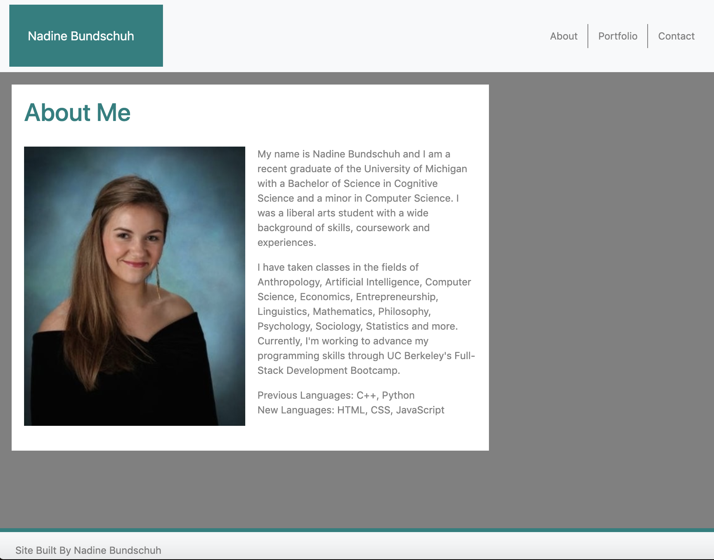
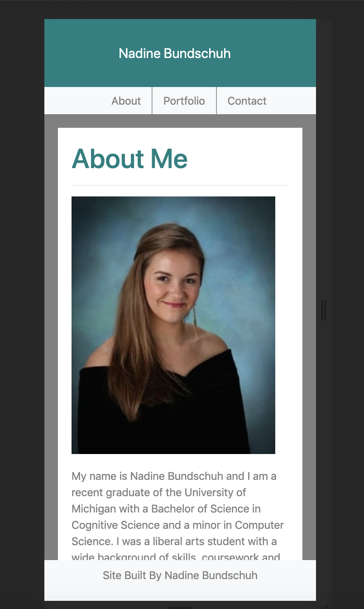

# CSS and Bootstrap: Responsive Portfolio

This is a draft of my portfolio featuring reponsive design to ensure that the web application renders well on a variety of devices and window or screen sizes. 


>Technologies: HTML, CSS, Bootstrap 

## Worked with:
1. Responsive Images
2. Responsive Layout
3. Navigation Bar 
4. Semantic HTML
5. Sticky Footer
6. Bootstrap Components and Layout
7. Grid System: wth Sub-rows and Sub-cols

## Website Snapshot
#




## Code Snippet
#
This example shows how the navbar was built using Bootstrap components and classes.
```
  <!-- Navigation Bar -->
  <nav class="navbar bg-light">
    <div class="title">
      <a class="navbar-brand" href="index.html">Nadine Bundschuh</a>
    </div>

    <button class="navbar-toggler" type="button" data-toggle="collapse" data-target="#navbarNavAltMarkup">
    </button>

    <ul class="nav justify-content-end">
      <li class="nav-item">
        <a class="nav-link active" href="index.html">About</a>
      </li>
      <li class="nav-item">
        <a class="nav-link" href="portfolio.html">Portfolio</a>
      </li>
      <li class="nav-item">
        <a class="nav-link" href="contact.html">Contact</a>
      </li>
    </ul>
  </nav>
```


## Author
#
Nadine Bundschuh

[LinkedIn](https://www.linkedin.com/in/nadine-bundschuh-731233b9)
|
[GitHub](https://github.com/nadineb1160)


